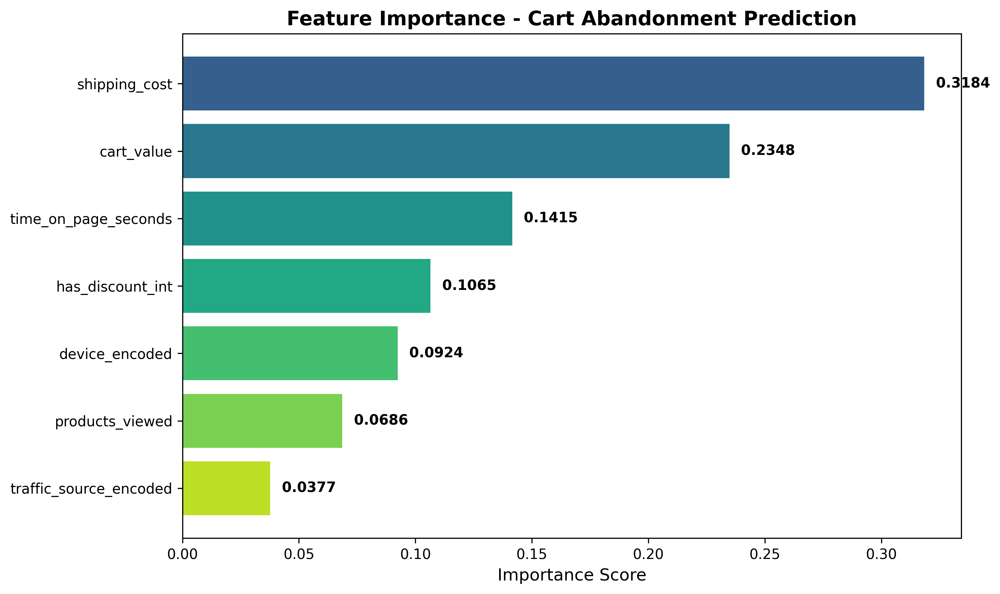

# E-Commerce Cart Abandonment Analysis

**Using data and ML to recover $1.55M in lost revenue**

---

## 🎯 The Problem

Nearly **half of customers** who add items to cart abandon before purchase. This project analyzes 100,000 shopping sessions to understand why and identifies who to target for recovery.

**Bottom Line:** $1.55M annual revenue opportunity.

---

## 📊 What I Built

**End-to-end analytics project in 4 phases:**

1. **Data:** Generated 100K realistic shopping sessions
2. **SQL Analysis:** Identified abandonment drivers through 5 queries
3. **Machine Learning:** Built model predicting who will abandon (58% precision)
4. **Dashboard:** Interactive Tableau visualization for stakeholders

---

## 💡 Key Findings

### The Numbers
- **46.83%** cart abandonment rate
- **23,865** abandoned carts
- **$1.55M** recovery potential (25% recovery rate)
- **21,292** high-risk users identified by ML model

### Why Users Abandon
1. **High shipping costs** (>$15) increase abandonment by 18%
2. **Mobile checkout** converts 5% lower than desktop
3. **No discount** users abandon 11% more

### Who to Target
ML model identifies high-risk users based on:
- Shipping cost (strongest predictor - 31.8% importance)
- Cart value
- Time spent browsing

---

## 🛠️ Technologies

**Data & Analysis:** Python, pandas, SQL, SQLite  
**Machine Learning:** scikit-learn, Random Forest  
**Visualization:** Tableau Public, matplotlib, seaborn  

---

## 🚀 Key Results

### SQL Analysis
Wrote 5 queries analyzing funnel performance:
- Overall conversion: 24.4%
- Cart abandonment: 46.8%
- Shipping tier impact: 36% (free) → 54% (>$15)
- Device comparison: Desktop beats Mobile by 5%

### Machine Learning
Random Forest model:
- 58% precision on test data
- Identified 4,176 high-risk users (>50% abandonment probability)
- Top predictor: Shipping cost (3x more important than other features)

### Dashboard
Interactive Tableau visualization showing:
- Customer journey funnel
- Abandonment drivers
- ML-based risk segmentation
- Business impact ($1.55M opportunity)

---

## 💼 Business Recommendations

**Priority Actions:**
1. **Free shipping threshold** ($75+) - Reduces abandonment by ~15%
2. **Target high-risk users** - Exit-intent popups with 10% discount
3. **Optimize mobile checkout** - Simplified forms, larger buttons
4. **Real-time ML scoring** - Trigger interventions before abandonment

**Expected Impact:** $400K-$600K annual revenue recovery

## 📸 Visualizations

### Funnel Analysis
Shows 47% drop-off at cart stage

### Feature Importance

### ML Model Performance

---

*Project completed as part of analytics portfolio development. Data is synthetic; methodology applicable to real e-commerce scenarios.*
